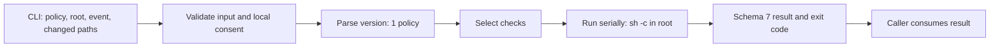
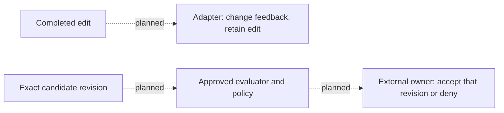

# Current architecture

IronLint evaluates developer-defined shell checks and returns structured results.
The `version: 1` core and CLI are implemented. The external acceptance integration
and completed-edit feedback adapter are still to build. Existing installers and
adapters use the older write-hook protocol; their presence does not establish v1
support. See the [remaining work](../plans/2026-09-05-ironlint-v1-implementation.md).

## Implemented v1 flow

| Responsibility | Source entry point |
| --- | --- |
| CLI arguments and usage-error output | `crates/ironlint-cli/src/cli.rs`, `crates/ironlint-cli/src/main.rs` |
| Config discovery and format dispatch | `crates/ironlint-cli/src/commands/config.rs` |
| Root/path validation, consent, CLI result | `crates/ironlint-cli/src/commands/check.rs` |
| V1 parsing and check selection | `crates/ironlint-core/src/config/v1.rs` |
| Serial evaluation and total deadline | `crates/ironlint-core/src/runner/v1.rs` |
| Process lifecycle, environment, output capture | `crates/ironlint-core/src/engine/execution.rs` |
| Schema-7 types and aggregate status | `crates/ironlint-core/src/verdict.rs` |
| Consent store and policy hashing | `crates/ironlint-core/src/trust/` |
| Installation ownership and artifact inspection | `crates/ironlint-core/src/adapter/`, `crates/ironlint-cli/src/commands/init/` |

`accept` selects every configured check. `change` selects checks opted into early
feedback, filtered by changed paths when known. Each selected check executes once,
in check-ID order. Bare globs such as `*.rs` match at any depth. A known empty path
set skips file-filtered checks; unknown paths run all change checks. Unconditional
change checks run in either case.

Paths are relative to the supplied root. CLI validation allows deleted paths,
rejects escapes (including symlinks resolving outside the root), and preserves
in-root symlink names for trigger matching. This validates trigger inputs; it
does not sandbox the command.

Commands run with stdin closed against the actual tree. The environment retains
`PATH`, `HOME`, `LANG`, `TZ`, `TMPDIR`, and `LC_*`, then supplies `IRONLINT_ROOT`,
`IRONLINT_EVENT`, and `IRONLINT_BIN`. Other inherited variables, including legacy
`IRONLINT_*` values, are removed. Defaults are 30 seconds per check and 300 seconds
per invocation. Each output stream retains at most 64 KiB and marks truncation.
Process cleanup and pipe draining are bounded; Unix uses process groups.

Command exits 1–125 are violations. Exits 126/127, high exits, signals, and timeouts
are execution errors. Evaluation continues after a violation, stops after an
execution error, and lists selected checks left unrun. Errors take precedence
over violations. See [JSON and exits](reference/verdict-json.md).

The CLI enforces execution consent before running commands. The core evaluator
does not enforce trust or perform acceptance. Hashing covers policy bytes and
managed `.ironlint/scripts/` content; it is not proof that arbitrary transitive
dependencies are safe. Read-only inspection does not require approval.

## Integration boundary still to build

The acceptance owner must protect the operation, fix policy/evaluator provenance,
bind results to the exact candidate, and isolate publication credentials from
candidate execution. A local pass, a trust hash, or a successful edit hook cannot
provide that authority. The [v1 contract](../specs/2026-09-05-ironlint-v1-design.md)
defines the required proof. No live v1 integration is currently claimed.

## Existing installation and code awaiting removal

The workspace currently has three crates: `ironlint-core`, `ironlint-cli`, and the
dependency-free `ironlint-bash-gate`. Unversioned configs still dispatch through
the older `write`/`pre-commit` runner, schema-6 verdicts, proposed-content ABI,
`extends`, `steps`, and suppression support. This is existing code awaiting the
breaking-release cleanup, not a compatibility requirement for v1.

`init` still scaffolds that format, installs write-hook adapters and a Git
pre-commit floor. `gate-bash` is config-less, separate from checks, and returns
0 to allow or 2 to block. It covers policy, adapter-installation and floor-hook
surfaces plus recognized Git bypass commands; shell indirection remains a gap.
It is a local guardrail, not an external authority boundary.

Remove IronLint-owned registrations before deleting commands they invoke. Keep
unrelated settings, chained hooks, and user edits. Current ownership/uninstall
machinery is the starting point; no config converter or rollback system is planned.

`validate`, `explain`, `show-resolved-config`, and `doctor` understand v1 configs.
Telemetry and `watch` still consume the existing write/pre-commit log format;
the v1 evaluator does not append those records. Their final disposition belongs
to the cleanup packet, with no telemetry/UI redesign in scope.

## Adapter evidence

The four existing adapters have contract suites in `scripts/ci-adapters.sh`.
Codex has captured `apply_patch` add/update payloads. Claude Code, pi, and
OpenCode declare capture-pending directories and use synthetic coverage.
These fixtures describe the existing hook protocol, not completed-edit v1 support.

Keep each `adapters/<harness>/fixtures/README.md` declaration and capture procedure
while its suite remains active. Missing provenance or removal of a pending
declaration can fail the fixture meta-tests. V1 requires one live-verified
feedback adapter; additional harness captures are not release requirements.
