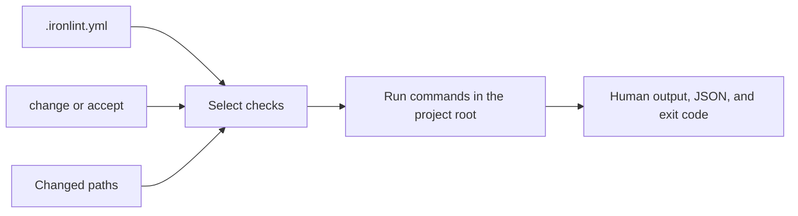

# How IronLint works

IronLint turns a project policy into a repeatable check run. The policy says
which shell commands matter; IronLint decides which ones apply, runs them, and
returns a result a person or another tool can act on.


```mermaid
flowchart LR
    Policy[".ironlint.yml"] --> Select["Select checks"]
    Event["change or accept"] --> Select
    Paths["Changed paths"] --> Select
    Select --> Run["Run commands in the project root"]
    Run --> Result["Human output, JSON, and exit code"]
```

## The policy

A `version: 1` policy maps stable check IDs to shell commands. A check can run
only at `accept`, or at both `change` and `accept`. The optional `files` field
narrows only the early `change` run. The command itself decides which files to
inspect. See the [policy reference](reference/config-schema.md).

## The two events

`change` is for quick feedback. IronLint runs checks that opted into `change`
and whose file patterns match the supplied paths. If the paths are unknown, it
runs all change checks.

`accept` is the complete run. It runs every configured check once, in check-ID
order, regardless of file patterns. Use it when a workflow needs a complete
answer about the current working tree.

## Command execution

Commands run through `sh -c` from the selected root with stdin closed. They see
the files on disk and may use `IRONLINT_ROOT`, `IRONLINT_EVENT`, and
`IRONLINT_BIN`. IronLint applies per-check and total time limits, retains a
bounded amount of output, and reports commands that did not finish. It does
not sandbox commands. See [writing checks](writing-checks/README.md).

## Results and boundaries

A check can pass, report a policy violation, or end with an execution error.
IronLint returns a human report by default or JSON with a documented exit code.
An empty `change` selection is successful evaluation, but it is not a complete
acceptance result. See [JSON results](reference/verdict-json.md).

Before CLI execution, IronLint requires local execution consent. That is a
record of what you reviewed, not a sandbox or a guarantee about a remote system.
If another system uses IronLint to decide whether to publish or merge work, that
system must protect its own credentials and connect the result to the exact
change it evaluated. See [execution consent](security/trust.md).

## Shared policy and execution

Core exposes a validated, read-only v1 policy with compiled file matchers. One
selector supplies both execution and explanation. An immutable `PolicySnapshot`
captures the policy bytes and managed-script identity. Library callers can
evaluate a snapshot directly; the CLI wraps it in local approval before running.
The existing approved-policy evaluator forwards to the same implementation.

```rust
use ironlint_core::{config::V1Event, policy::PolicySnapshot, runner::evaluate_v1_snapshot};
use std::path::Path;

let snapshot = PolicySnapshot::load(Path::new("/work/policy.yml"))?;
let verdict = evaluate_v1_snapshot(&snapshot, Path::new("/work/candidate"), V1Event::Accept, None)?;
```

One monotonic total deadline starts before selection and includes verification,
commands, output handling, and final verification. Snapshot loading and consent
lookup happen first. Verification streams script content with a fixed buffer,
preserving the consent hash framing. Checks cannot start after budget expiry;
expired final verification returns an error even if every command passed.
Filesystem deadline checks are cooperative, and process cleanup has a bounded
grace period.

The additive `evaluate_v1_cancellable` and `evaluate_v1_snapshot_cancellable`
entry points accept an explicit `AtomicBool` cancellation flag. Cancellation
prevents further commands, stops and reaps the active command, and produces an
`execution_cancelled` error. Existing entry points use an unset flag. Pi uses
an opt-in CLI stdin-close channel to request this cleanup before its bounded
forced-stop fallback; command stdin remains closed.

## Installation writes

Owned replacements use an exclusively created sibling temporary file, complete
writes and sync, then atomic publication. Existing modes are preserved; explicit
Git-hook installation adds owner execute permission. Policy scaffolding uses
exclusive creation at the final path and refuses symlinks. First backups publish
complete bytes without overwriting an existing backup.

IronLint mutations of shared resources acquire locks in a stable order and
re-read state under those locks. These locks coordinate IronLint processes;
editors and other programs do not participate. A pending ownership intent lets
an interrupted adapter installation repair metadata on retry while preserving
foreign or edited content. Diagnostics inspect both scopes and report incomplete
ownership, unreadable registrations, and inactive Git hooks without executing them.

## Source map

| Behavior | Source |
| --- | --- |
| Validated policy and selection | `crates/ironlint-core/src/config/` |
| Immutable snapshot, consent hashing, and streamed scripts | `crates/ironlint-core/src/policy.rs`, `trust/policy_hash.rs`, `trust/script_files.rs` |
| Serial evaluation, deadlines, and process execution | `crates/ironlint-core/src/runner/`, `deadline.rs`, `engine/` |
| Local execution consent | `crates/ironlint-core/src/trust/` |
| Atomic publication and resource locks | `crates/ironlint-core/src/filesystem.rs`, `filesystem/locks.rs` |
| Adapter ownership and materialization | `crates/ironlint-core/src/adapter/` |
| Setup, inspection, diagnostics, and updater | `crates/ironlint-cli/src/commands/` |
| Pi feedback subprocess lifecycle | `adapters/pi/src/index.ts` |
