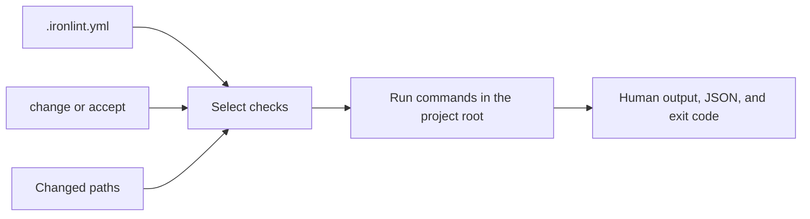

# How IronLint works

IronLint turns a project policy into a repeatable check run. The policy says
which shell commands matter; IronLint decides which ones apply, runs them, and
returns a result a person or another tool can act on.

```mermaid
flowchart LR
    Policy[".ironlint.yml"] --> Select["Select checks"]
    Event["change or accept"] --> Select
    Paths["Changed paths"] --> Select
    Select --> Run["Run commands in the project root"]
    Run --> Result["Human output, JSON, and exit code"]
```

## The policy

A `version: 1` policy maps stable check IDs to shell commands. A check can run
only at `accept`, or at both `change` and `accept`. The optional `files` field
narrows only the early `change` run. The command itself decides which files to
inspect. See the [policy reference](reference/config-schema.md).

## The two events

`change` is for quick feedback. IronLint runs checks that opted into `change`
and whose file patterns match the supplied paths. If the paths are unknown, it
runs all change checks.

`accept` is the complete run. It runs every configured check once, in check-ID
order, regardless of file patterns. Use it when a workflow needs a complete
answer about the current working tree.

## Command execution

Commands run through `sh -c` from the selected root with stdin closed. They see
the files on disk and may use `IRONLINT_ROOT`, `IRONLINT_EVENT`, and
`IRONLINT_BIN`. IronLint applies per-check and total time limits, retains a
bounded amount of output, and reports commands that did not finish. It does
not sandbox commands. See [writing checks](writing-checks/README.md).

## Results and boundaries

A check can pass, report a policy violation, or end with an execution error.
IronLint returns a human report by default or JSON with a documented exit code.
An empty `change` selection is successful evaluation, but it is not a complete
acceptance result. See [JSON results](reference/verdict-json.md).

Before executing a policy, IronLint requires local execution consent. That is a
record of what you reviewed, not a sandbox or a guarantee about a remote system.
If another system uses IronLint to decide whether to publish or merge work, that
system must protect its own credentials and connect the result to the exact
change it evaluated. See [execution consent](security/trust.md).
